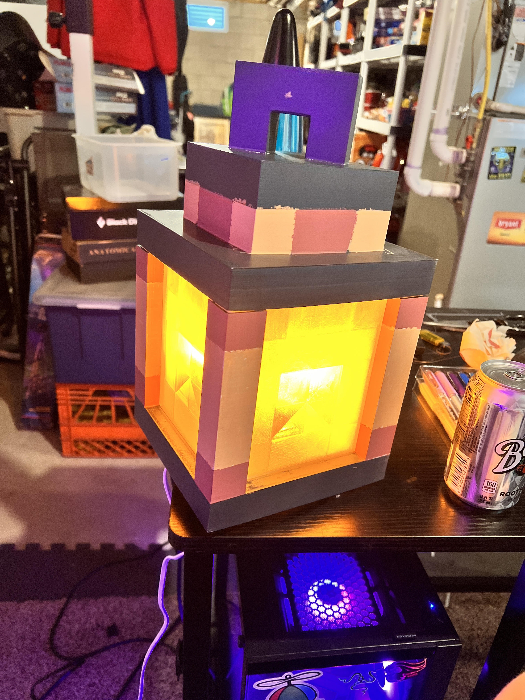

# Minecraft Lantern

## Overview

This was one of my beloved projects. A childhood game that I get to bring into real life and its 1:1 scale. I chose this project because ive made one previously but it being so small
made it feel pathetic, and I needed to go bigger. The lantern was also created as a gift to a friend of mine, in which I havnt seen it since but im sure he still has it.

## Project Details

* Model Source: Third-party STL / Licensed file / Public source
* Printer: Elegoo Neptune 4 Pro
* Material: PLA
* Print Time: Approx. 20 hours
* Pieces: 3 parts (top, bottom, glass pieces)

## Work Performed

* Sliced and prepared parts for printing
* Sanded and assembled components
* Primed and painted final model
* Measured existing lightbulb socket dimensions for proper fitment

## Challenges

* Warping on larger pieces
* Visible seams after assembly
* Printing lantern glass to look as transparent to my liking
* Print failing midway

## Solutions

* Added brim / adjusted temperatures
* Scarf joint hides seams effectively
* Used filler primer and sanding
* Measure with calipers, cut print at where it failed, then glue pieces

## Skills Demonstrated

* 3D printer operation
* Troubleshooting
* Post-processing
* Attention to detail
* Project management

## Gallery

