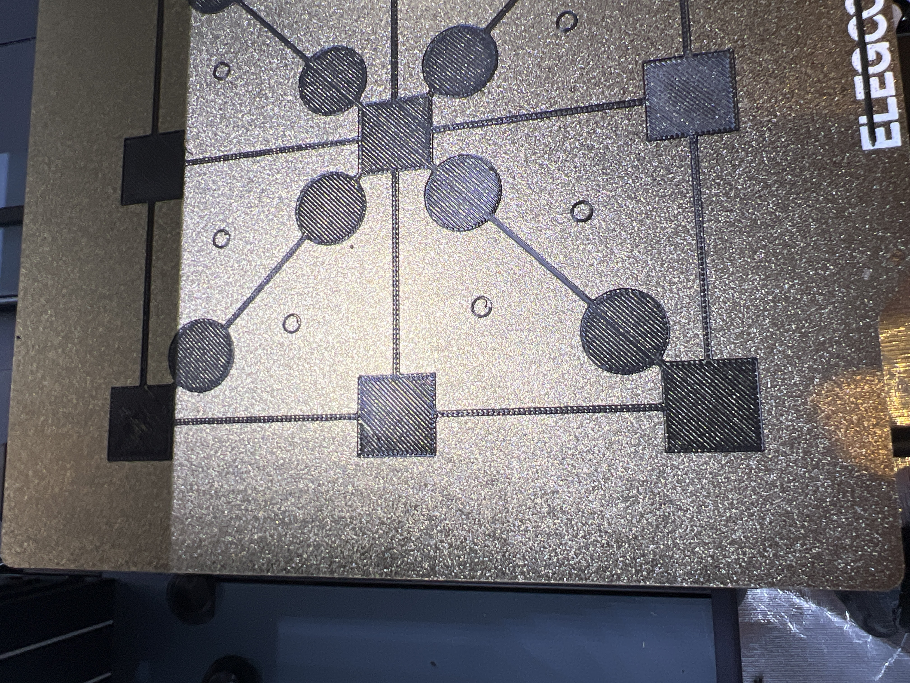

# Overview
With several trials, there will be several errors. Here is a gallary of some fails and mishaps that have happened over my journey of 3D printing. Along that, I will explain as why this could have happened(as most happened when im not present) and how to prevent them from future projects.

## Why this happened
This is a simple but vital test to do when troubleshooting prints. It tests the entire plate to see where the printer can and will fail. Although this isnt a fail, this is still concerning
The gaps in between the fillament means that the Z Offset is too high, meaning that it does not squish down on the print bed hard enough, significantly reducing its strength on the print bed.
## Solution
Simply level the bed. Leveling the bed and lowering the offset bring the print head closer to the bed, closing these ugly lines and effectively removing them. 
